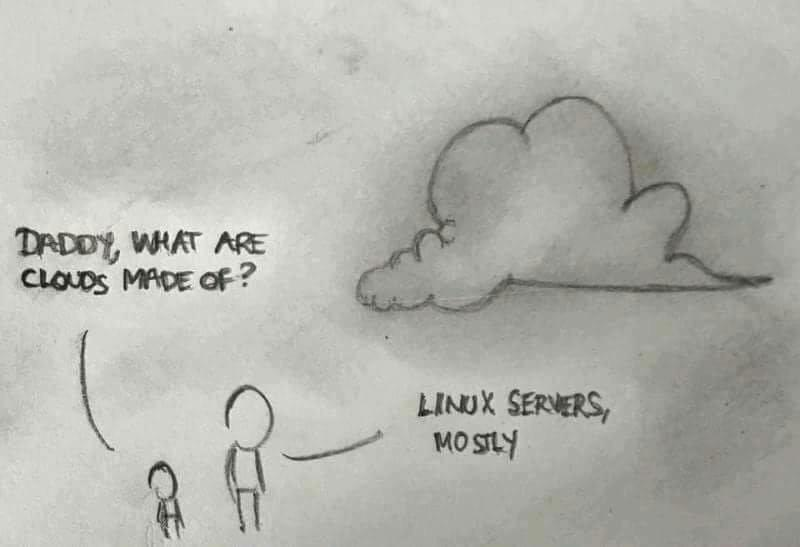
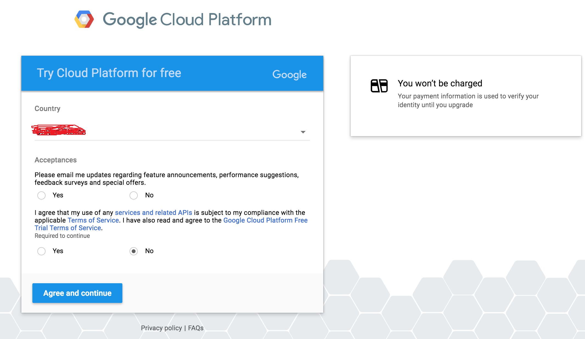
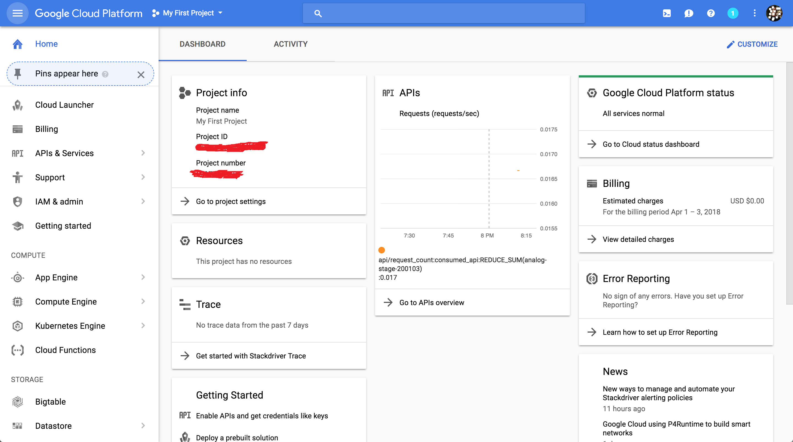
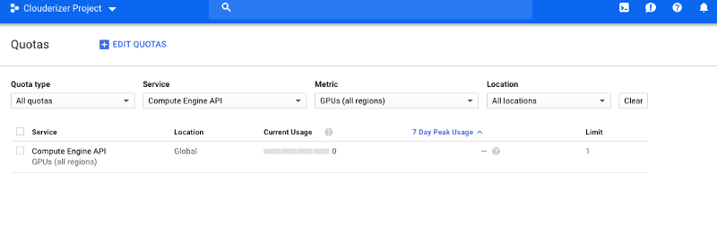
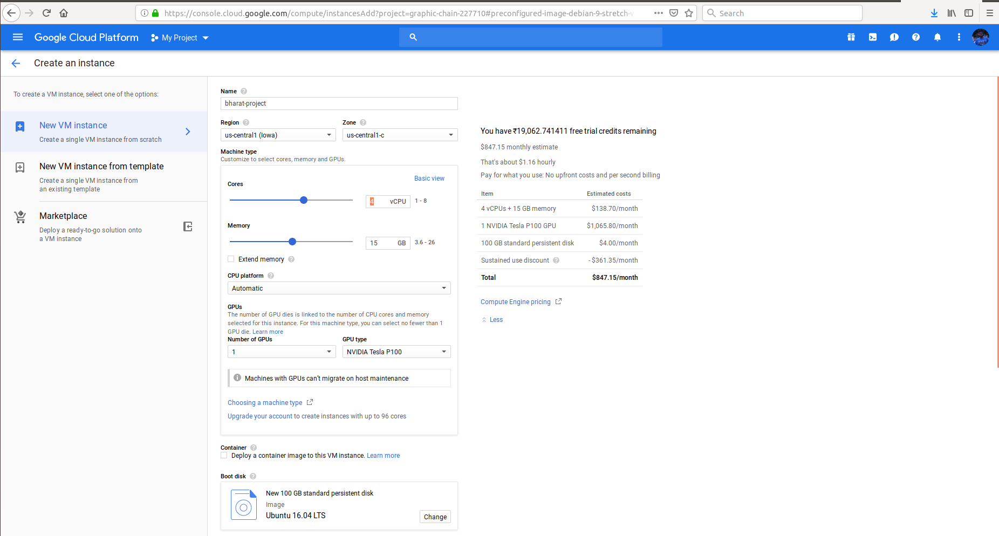
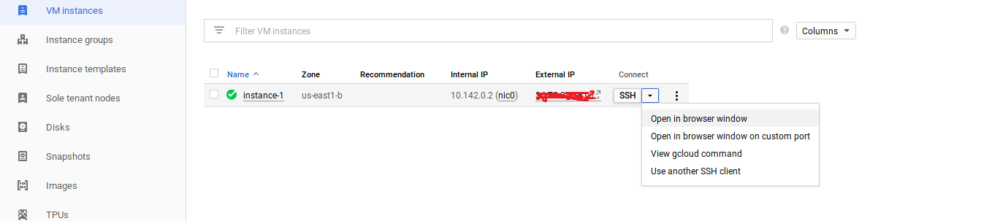
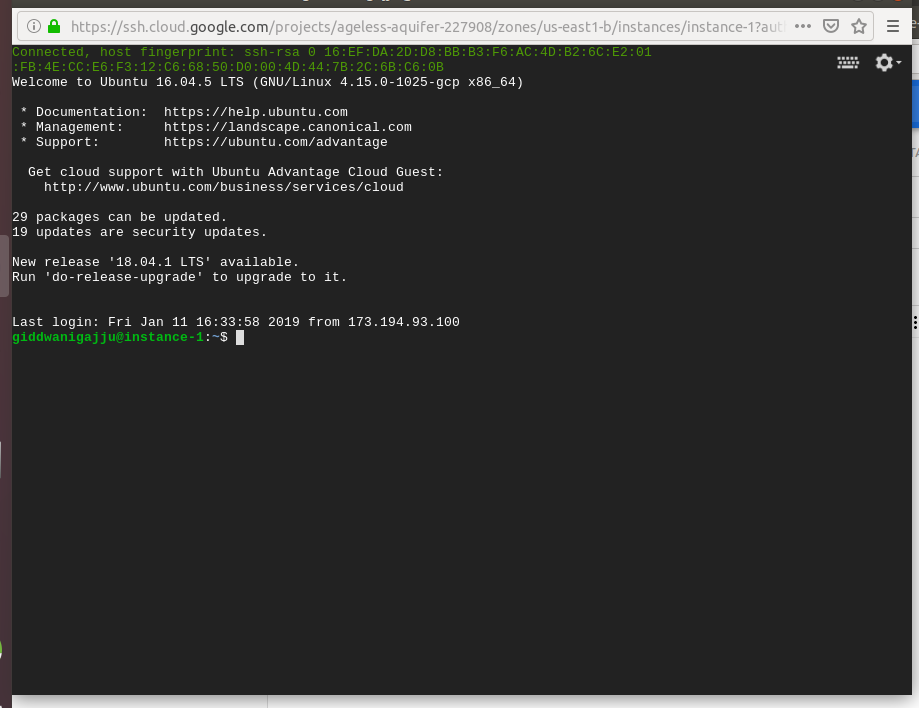

# Google Cloud: An-Easy-Way-to-an-Amazing-Platform
Best descripted way to use your google cloud account for free free free :alien:

## Why Clouds?

        “Telescope viewfinder on top of the Eiffel Tower in the rain.” by Made By Morro on Unsplash"

So you finally decided to get into the Deep Learning game only to realize that training your Deep Learning models on your laptop takes a zillion years because either you don’t have a GPU and so you have to train your models on a CPU or you are even more unlucky and are stuck with AMD. Either way, I know how it feels and it truly sucks :disappointed:
       
                                        Get your game on already, AMD!

## What is cloud computing ?

In cloud computing, the capital investment in building and maintaining data centers is replaced by consuming IT resources as an elastic, utility-like service from a cloud “provider” (including storage, computing, networking, data processing and analytics, application development, machine learning, and even fully managed services).
      

## Google Cloud Platform $300 free credit — incredible offer for Deep Learning students

Hello friends! :heart_eyes:

If your are a Machine Learning Engineer/ Deep Learning Engineer / Developer and still haven't signed up for GCP account, you can enable GCP from any of your gmail account from here: https://cloud.google.com/free/ and get $300 free credit for first year(free wow gpu for 12 months). This credit is good enough for almost 1000 hours of Nvidia Tesla K80 GPUs or Nvidia Tesla P100 GPUs!!

# Before We Begin:

                                # --BIG REMINDER: Make sure you stop your instances!--

Don’t forget to stop your instance when you are done (by clicking on the stop button at the top of the page showing your instances), otherwise you will run out of credits and that will be saddening. :pensive:

If you follow our instructions below correctly, you should be able to restart your instance and the downloaded software will still be available.

 

# Create and Configure Your Account:

If you don’t have a Google Cloud account, create one by going to the Google Cloud homepage: https://cloud.google.com/free/ and clicking on Compute. When you get to the next page, click on the blue TRY IT FREE button. If you are not logged into gmail, you will see a page that looks like the one below. Sign into your gmail account or create a new one if you do not have an account, fill all the neccessary card details( you can use any credit card or debit card(Not SBI) as a payment method).

 

Click the appropriate yes or no button for the first option, and check yes for the second option after you have read the required agreements. Press the blue Agree and continue button to continue to the next page to enter the requested information (your name, billing address and credit card information). Remember to select “Individual” as “Account Type”:

 

Once you have entered the required information, press the blue Start my free trial button. You will be greeted by a page like this:
Tan Tadha da dha--- Now you are in  your Google Cloud Platform!! Click on Google Cloud Platform appeared in blue colour at the top left corner, and it will take you to the main dashboard:
 
                                            Dashboard will looks like
  
 
 ## Important Note

Some users, who have signed up for GCP recently, can see this error on starting their projects:

                         “Quota ‘GPUS_ALL_REGIONS’ exceeded. Limit: 0.0 globally.” 

Please go to `Dashboard-> IAM & admin -> Quotas` -> and search for the following quota `GPUs (all region)`.
 
In case limit for this is 0, you need to request Google to increase this to 1 or whatever value you need by clicking on `Edit Quotas`.

## Create a Virtual Instance:

To launch a virtual instance:-: `Compute Engine-> VM Instances-> Create`.

This will take you to a page that looks like the screenshot below. 

`(NOTE: Please carefully read the instructions in addition to looking at the screenshots. The instructions tell you generally what values I prefer to fill in :)).`

 

Name: `xyz` --> Zone: `us-central-1-c` --> (click on custoomize) CPU & Memory size: `4`--> GPU :`1 -Nvdia Tesla P100 or K80` (would be affordable) --> click `change` boot disk and select `ubuntu 16.04` as defualt and `100 GB disk size` -->Check and select Allow HTTP traffic and Allow HTTPS traffic --> atlast Press `Create`.

Bravo! You have successfully created your `VM instance` -- It will be set permanently fixed which contains Internal and External IP addresses ( From here your gpu start costing your credits). See below screenshot

  
 
 ## Most Important but Most Panicking Setup in few commands lines: :)
 
 Now setup your google cloud platform:
 
 After generating a VM Instance--> Click on a `key` near to SSH as encircled--> `open in browser window` --> a google `Active Cloud Shell` !!
 
 
  
 
Here in this repository you can find a .txt file named `gcloud_gpu.txt` inside a folder `gpu`. As of now simply speaking copy & paste each and every command lines into the google cloud terminal, you will observe that we are already on their server, the internet speed , smoothness everything is far better compared to your local machine.

From the last two lines I have installed "tensorflow-gpu" in google-cloud and tested it in the terminal. 
 
For further testing I have included a `gpu_mnist_speedcheck.py`: just copy the code into the terminal of your gcp engine and press enter--- tadha da :sunglasses:-- and now you will observe that training is approxiemateky 15 times as compared to local machine.

### Note: 

Here you can install all the required libraries (such as pytorch, mxnet etc.) whatever you want for your deep learning projects.
And after completing your training module , please press `Stop` near SSH (on 3 dots) to stop your instances to secure your credits for longer duration. 

                                    Thank You Everyone  See you soon!
  
 (Special Thanks `Kumar Subham Sir - https://github.com/krsubham48?tab=repositories` : for this wonderfull series of commands) 
